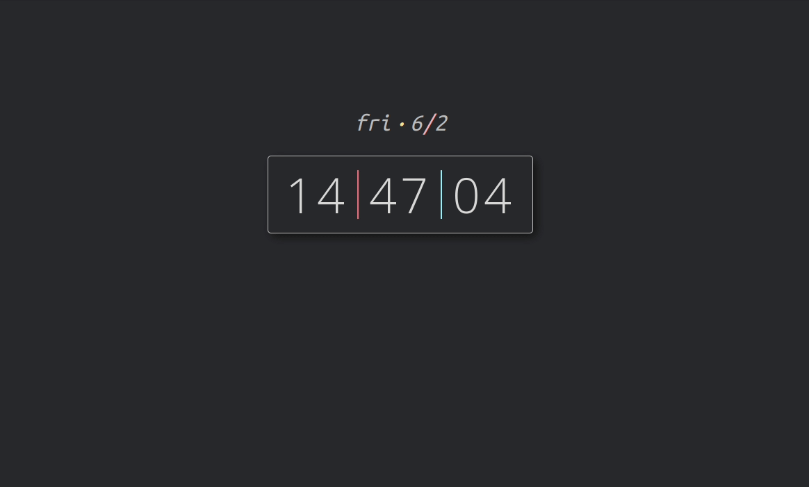

# chromepage

Personalized override of Chrome New Tab page, forked from https://github.com/karenying/chromepage. Thanks, Karen!

See a live demo [here](https://karenying.github.io/chromepage/).

## Installation

1. Clone this repo.
2. Head over to Chrome Extensions (usually `chrome://extensions` in the address bar) and turn "Developer Mode" on the top left.
3. Click "Load unpack" and select the destination as this cloned repository.
